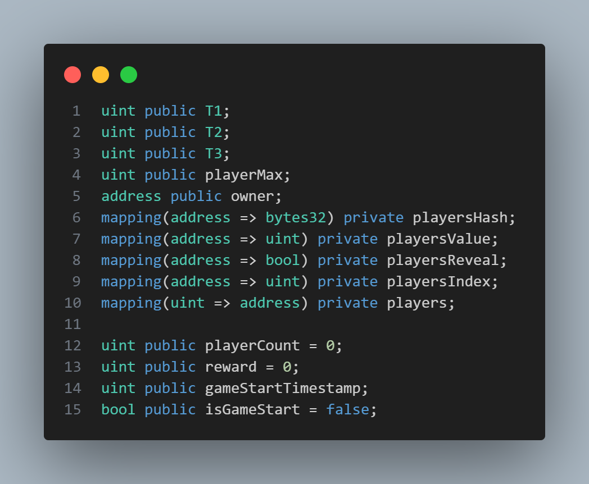
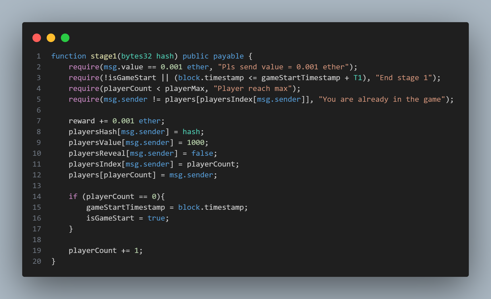

# multi-party-lottery

This is a multi-party lottery contract that allow multiple players to join the game and find the winner by value of the player.

## Variable Field

{:height="100%" width="100%"}
`T1` is time of stage 1.
`T2` is time of stage 2.
`T3` is time of stage 3.
`playerMax` is the maximum number of players.
`owner` is the address owner of the contract.
`playersHash` is the hash of the player.
`playersValue` is the value when revealed of the player.
`playerReveal` is the reveal status of the player.
`playerIndex` is the index of the player.
`players` is the address of the player by index.
`playerCount` is the number of players.
`reward` is the reward of the game.
`gameStartTimestamp` is the start time of the game that start when first player join.
`isGameStart` is the status of the game.

## Constructor

{:height="100%" width="100%"}
Owner can set `T1`, `T2`, `T3`, `playerMax` in the constructor and also set the `owner` of the contract.

## Reset Game State

{:height="100%" width="100%"}

Reset game state by reset all the variable field to the initial state.

## Game State

{:height="100%" width="100%"}

This function is to get the game state of the contract that use for debugging.

## Hash With Salt

{:height="100%" width="100%"}

This function is to hash the player address with the salt.

## Stage 1

{:height="100%" width="100%"}

This function is to join the game by sending the hash of value.

- Player must send the value of 0.1 ether to join the game.
- Game must in the stage 1 to join the game.
- Player must not exceed the maximum number of players.
- Player must not join the game before.

Then the player will be added to the game and initialize the player.

## Stage 2

{:height="100%" width="100%"}

This function is to reveal the value of the player.

- Player must send value and salt to reveal the value.
- Player must send value between 0 to 999
- Game must in the stage 2 to reveal the value.

Then the player will mark as revealed and the value will be stored.

## Stage 3

{:height="100%" width="100%"}

This function is to find the winner of the game.

- Game must in the stage 3 to find the winner.
- This function is only owner to call the function.

The winner is calculate by xor all the revealed value of the player and hash then mod with the number of revealed players that will be index of winner.

- If winner is found, the reward will be sent to the winner 98% and to owner 2%.
- If no revealed player, the reward will be sent to owner.

## Stage 4

{:height="100%" width="100%"}

This function is to withdraw the reward of the player when end of stage 4.

- Game must in the stage 4 to withdraw the reward.
- Player must join the game before.

The reward will be sent to the player then player will be mark as withdraw.
